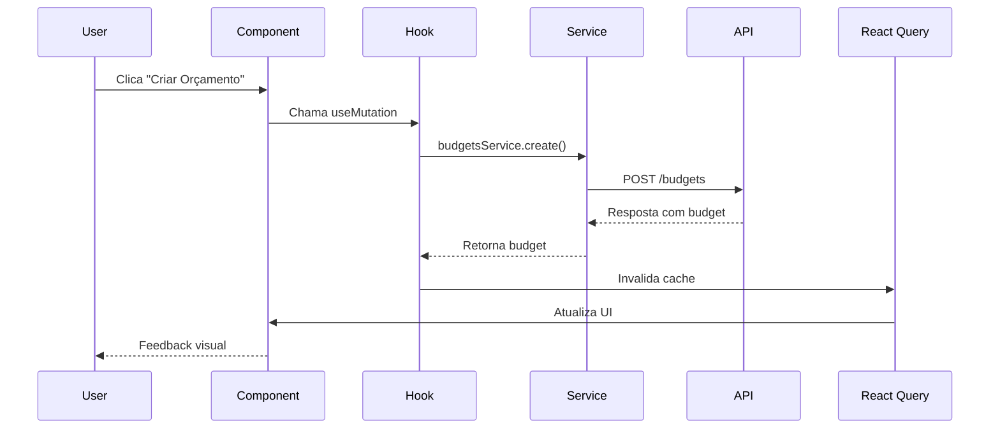
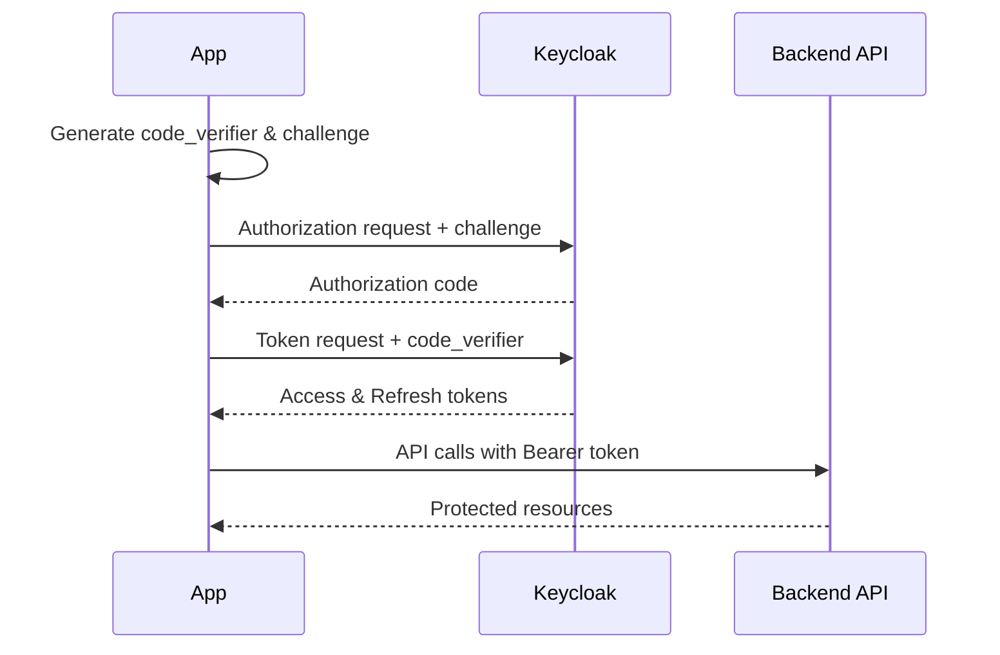

# Arquitetura - Guia Técnico

## 📋 Índice
- [Visão Geral da Arquitetura](#visão-geral-da-arquitetura)
- [Stack Tecnológica](#stack-tecnológica)
- [Estrutura de Pastas](#estrutura-de-pastas)
- [Padrões Arquiteturais](#padrões-arquiteturais)
- [Fluxo de Dados](#fluxo-de-dados)
- [Gerenciamento de Estado](#gerenciamento-de-estado)
- [Navegação](#navegação)
- [Autenticação](#autenticação)
- [API e Serviços](#api-e-serviços)

## 🏗️ Visão Geral da Arquitetura

PoupeAI Mobile segue uma arquitetura modular baseada em:

```
┌─────────────────┐    ┌─────────────────┐    ┌─────────────────┐
│   Presentation  │    │    Business     │    │      Data       │
│     Layer       │◄──►│     Logic       │◄──►│     Layer       │
└─────────────────┘    └─────────────────┘    └─────────────────┘
│                      │                      │
├─ Screens            ├─ Hooks              ├─ API Services
├─ Components         ├─ Contexts           ├─ Types
├─ Navigation         ├─ Utils              └─ Constants
└─ Styles             └─ Validation
```

### Princípios Fundamentais

1. **Separação de Responsabilidades**: Cada camada tem responsabilidades bem definidas
2. **Inversão de Dependência**: Componentes dependem de abstrações, não implementações
3. **Single Responsibility**: Cada módulo/componente tem uma única responsabilidade
4. **DRY (Don't Repeat Yourself)**: Reutilização máxima de código
5. **SOLID Principles**: Aplicados na estrutura de componentes e serviços

## 🛠️ Stack Tecnológica

### Core Framework
- **React Native 0.76.9**: Framework principal
- **Expo 52.0**: Toolchain e serviços
- **TypeScript 5.3**: Tipagem estática
- **Expo Router 4.0**: Roteamento file-based

### Estado e Dados
- **React Query 5.83**: Cache e sincronização de estado servidor
- **Context API**: Estado global (Auth, Theme)
- **AsyncStorage**: Persistência local
- **Zod 4.0**: Validação de schemas

### UI e Navegação
- **React Navigation 7.0**: Navegação nativa
- **Expo Vector Icons**: Iconografia
- **React Native Gesture Handler**: Gestos
- **React Native Reanimated**: Animações

### Autenticação
- **Expo Auth Session**: Fluxo OAuth2
- **Keycloak**: Servidor de autenticação
- **PKCE**: Segurança para aplicações móveis

### Desenvolvimento
- **ESLint**: Linting
- **Prettier**: Formatação
- **React Hook Form**: Formulários
- **Metro**: Bundler

## 📁 Estrutura de Pastas

```
poupeai-mobile/
├── 📱 app/                    # Roteamento (expo-router)
│   ├── _layout.tsx           # Providers raiz
│   ├── login.tsx             # Tela de login
│   ├── oauth.tsx             # Callback OAuth  
│   └── (drawer)/             # Área autenticada
│       ├── _layout.tsx       # Layout do drawer
│       └── (tabs)/           # Navegação por abas
│           ├── index.tsx     # Dashboard
│           ├── transactions.tsx
│           ├── budgets.tsx
│           ├── goals.tsx
│           └── profile.tsx
│
├── 🎨 assets/                 # Recursos estáticos
│   ├── icons/
│   ├── images/
│   └── fonts/
│
├── 🧩 src/
│   ├── components/           # UI Components (Atomic Design)
│   │   ├── atoms/           # Elementos básicos
│   │   │   ├── Button/
│   │   │   ├── Text/
│   │   │   └── FormField/
│   │   ├── molecules/       # Combinações funcionais
│   │   │   ├── TransactionsList/
│   │   │   ├── BudgetModal/
│   │   │   └── CategoryModal/
│   │   └── screens/         # Telas completas
│   │       ├── Dashboard/
│   │       ├── Transactions/
│   │       └── Login/
│   │
│   ├── 🔧 config/            # Configurações
│   │   ├── auth.ts          # Config OAuth/Keycloak
│   │   └── api.ts           # Config da API
│   │
│   ├── 🌍 contexts/          # Contextos React
│   │   ├── AuthContext.tsx  # Autenticação
│   │   └── ThemeContext.tsx # Temas
│   │
│   ├── 🎣 hooks/             # Custom Hooks
│   │   ├── useAuth.ts
│   │   ├── useBudgets.ts
│   │   └── useCategories.ts
│   │
│   ├── 🚀 providers/         # Providers
│   │   └── ReactQueryProvider.tsx
│   │
│   ├── 🌐 services/          # Camada de API
│   │   ├── api.ts           # Cliente base
│   │   ├── budgets.ts       # Serviço de orçamentos
│   │   └── categories.ts    # Serviço de categorias
│   │
│   ├── 📝 types/             # Definições TypeScript
│   │   ├── index.ts
│   │   ├── budgets.ts
│   │   ├── categories.ts
│   │   └── transactions.ts
│   │
│   ├── 🔨 utils/             # Utilitários
│   │   ├── date.ts          # Manipulação de datas
│   │   ├── currency.ts      # Formatação monetária
│   │   └── validation.ts    # Schemas de validação
│   │
│   └── 📊 constants/         # Constantes
│       ├── theme.ts         # Cores e temas
│       ├── tabs.ts          # Configuração de abas
│       └── api.ts           # URLs e endpoints
│
├── 📚 docs/                  # Documentação
├── 🧪 __tests__/             # Testes
└── 📦 node_modules/          # Dependências
```

## 🏛️ Padrões Arquiteturais

### 1. Atomic Design

Organizamos componentes seguindo a metodologia Atomic Design:

```
🔬 Atoms (Elementos básicos)
├─ Button, Text, Input, Icon
├─ Reutilizáveis e sem dependências
└─ Focados em uma única função

🧬 Molecules (Combinações funcionais)  
├─ TransactionItem, SearchBox, Modal
├─ Combinam atoms para funcionalidades
└─ Ainda reutilizáveis

🖥️ Screens (Páginas completas)
├─ Dashboard, Transactions, Profile
├─ Combinam molecules e atoms
└─ Específicas para cada tela
```

### 2. Container/Presentational Pattern

```typescript
// Container (Lógica)
export const TransactionsContainer = () => {
  const { data, loading, error } = useTransactions();
  const { mutate: deleteTransaction } = useDeleteTransaction();
  
  return (
    <TransactionsPresentation
      transactions={data}
      loading={loading}
      onDelete={deleteTransaction}
    />
  );
};

// Presentational (UI)
export const TransactionsPresentation = ({ transactions, loading, onDelete }) => {
  return (
    <TransactionsList 
      data={transactions}
      loading={loading}
      onDelete={onDelete}
    />
  );
};
```

### 3. Custom Hooks Pattern

Encapsulamos lógica de negócio em hooks customizados:

```typescript
// Lógica específica do domínio
export const useBudgets = (filters?: BudgetFilters) => {
  return useQuery({
    queryKey: budgetsKeys.list(filters),
    queryFn: () => budgetsService.getBudgets(filters),
    staleTime: 5 * 60 * 1000, // 5 minutos
  });
};

// Lógica de UI
export const useBudgetModal = () => {
  const [visible, setVisible] = useState(false);
  const [editingBudget, setEditingBudget] = useState<Budget | null>(null);
  
  const openCreate = () => {
    setEditingBudget(null);
    setVisible(true);
  };
  
  const openEdit = (budget: Budget) => {
    setEditingBudget(budget);
    setVisible(true);
  };
  
  return { visible, editingBudget, openCreate, openEdit, close: () => setVisible(false) };
};
```

### 4. Service Layer Pattern

Abstraímos chamadas de API em uma camada de serviço:

```typescript
class BudgetsService extends BaseApiService {
  async getBudgets(params?: BudgetParams): Promise<BudgetsResponse> {
    const response = await this.get<BudgetsResponse>('/budgets', { params });
    return response.data;
  }
  
  async createBudget(data: CreateBudgetRequest): Promise<Budget> {
    const response = await this.post<Budget>('/budgets', data);
    return response.data;
  }
}

export const budgetsService = new BudgetsService();
```

## 🌊 Fluxo de Dados

### 1. Fluxo de Dados Unidirecional

```
User Action → Component → Hook → Service → API → State Update → Re-render
```

### 2. Exemplo Prático - Criação de Orçamento



### 3. Cache Strategy

```typescript
// Chaves hierárquicas para cache eficiente
export const budgetsKeys = {
  all: ['budgets'] as const,
  lists: () => [...budgetsKeys.all, 'list'] as const,
  list: (filters: BudgetFilters) => [...budgetsKeys.lists(), { filters }] as const,
  details: () => [...budgetsKeys.all, 'detail'] as const,
  detail: (id: number) => [...budgetsKeys.details(), id] as const,
};

// Invalidação inteligente
const createBudgetMutation = useMutation({
  mutationFn: budgetsService.createBudget,
  onSuccess: () => {
    // Invalida apenas listas, mantém detalhes
    queryClient.invalidateQueries({ queryKey: budgetsKeys.lists() });
  },
});
```

## 🔄 Gerenciamento de Estado

### 1. Hierarquia de Estado

```
┌─ Server State (React Query)
│  ├─ API Data (budgets, categories, transactions)
│  ├─ Loading States
│  └─ Error States
│
├─ Global State (Context)
│  ├─ Authentication (user, tokens)
│  └─ Theme (mode, colors)
│
├─ Navigation State (React Navigation)
│  ├─ Current Route
│  └─ Navigation History
│
└─ Local State (useState/useReducer)
   ├─ Form Data
   ├─ Modal Visibility
   └─ UI Interactions
```

### 2. React Query Configuration

```typescript
const queryClient = new QueryClient({
  defaultOptions: {
    queries: {
      staleTime: 5 * 60 * 1000,      // 5 minutos
      gcTime: 10 * 60 * 1000,        // 10 minutos
      retry: (failureCount, error) => {
        if (error?.status === 401) return false; // Não retry auth errors
        return failureCount < 3;
      },
      refetchOnWindowFocus: true,
      refetchOnReconnect: true,
    },
    mutations: {
      retry: (failureCount, error) => {
        if (error?.status >= 400 && error?.status < 500) return false;
        return failureCount < 2;
      },
    },
  },
});
```

### 3. Context Pattern

```typescript
// AuthContext com navigation integration
export function AuthProvider({ children }: AuthProviderProps) {
  const [user, setUser] = useState<User | null>(null);
  const [isLoading, setIsLoading] = useState(true);
  const segments = useSegments();
  const router = useRouter();

  // Automatic navigation based on auth state
  useEffect(() => {
    const inAuthGroup = segments[0] === '(drawer)';
    
    if (!user && inAuthGroup) {
      router.replace('/login');
    } else if (user && !inAuthGroup) {
      router.replace('/(drawer)/(tabs)/');
    }
  }, [user, segments]);

  return (
    <AuthContext.Provider value={{ user, isLoading, signIn, signOut }}>
      {children}
    </AuthContext.Provider>
  );
}
```

## 🧭 Navegação

### 1. Estrutura de Navegação

```
Stack Navigator (Root)
├─ Login Screen
├─ OAuth Callback Screen
└─ Drawer Navigator (Authenticated)
    ├─ Tab Navigator
    │   ├─ Dashboard
    │   ├─ Transactions
    │   ├─ Budgets
    │   └─ Profile
    └─ Modal Screens
        ├─ Settings
        ├─ Help
        └─ Reports
```

### 2. File-based Routing (Expo Router)

```
app/
├── _layout.tsx              # Root layout com providers
├── login.tsx               # Login screen
├── oauth.tsx               # OAuth callback
└── (drawer)/               # Authenticated area
    ├── _layout.tsx         # Drawer navigator
    └── (tabs)/             # Tab navigator
        ├── _layout.tsx     # Tab configuration
        ├── index.tsx       # Dashboard (/)
        ├── transactions.tsx # /transactions
        ├── budgets.tsx     # /budgets
        └── profile.tsx     # /profile
```

### 3. Deep Linking

```typescript
// app.json
{
  "expo": {
    "scheme": "ai.poupe",
    "android": {
      "intentFilters": [{
        "action": "VIEW",
        "category": ["DEFAULT", "BROWSABLE"],
        "data": { "scheme": "ai.poupe" }
      }]
    }
  }
}

// Supported URLs:
// ai.poupe://login
// ai.poupe://transactions
// ai.poupe://budgets/123
```

## 🔐 Autenticação

### 1. OAuth2 + PKCE Flow



### 2. Token Management

```typescript
export class AuthService {
  private async refreshToken(): Promise<TokenData> {
    const storedTokens = await this.getStoredTokens();
    if (!storedTokens?.refresh_token) {
      throw new Error('No refresh token available');
    }

    const response = await fetch(discoveryEndpoints.tokenEndpoint, {
      method: 'POST',
      headers: { 'Content-Type': 'application/x-www-form-urlencoded' },
      body: new URLSearchParams({
        grant_type: 'refresh_token',
        client_id: keycloakConfig.clientId,
        refresh_token: storedTokens.refresh_token,
      }),
    });

    const tokens = await response.json();
    await this.storeTokens(tokens);
    return tokens;
  }
}
```

### 3. API Interceptors

```typescript
// Automatic token injection
api.interceptors.request.use(async (config) => {
  const tokens = await AsyncStorage.getItem(storageKeys.tokens);
  if (tokens) {
    const { access_token } = JSON.parse(tokens);
    config.headers.Authorization = `Bearer ${access_token}`;
  }
  return config;
});

// Automatic token refresh
api.interceptors.response.use(
  (response) => response,
  async (error) => {
    if (error.response?.status === 401) {
      try {
        await authService.refreshToken();
        return api.request(error.config);
      } catch (refreshError) {
        await authService.logout();
        router.replace('/login');
      }
    }
    return Promise.reject(error);
  }
);
```

## 🌐 API e Serviços

### 1. Base API Service

```typescript
class BaseApiService {
  protected baseURL = process.env.EXPO_PUBLIC_API_BASE_URL;
  
  protected async request<T>(
    endpoint: string,
    options: RequestOptions = {}
  ): Promise<ApiResponse<T>> {
    const url = `${this.baseURL}${endpoint}`;
    const config = this.buildConfig(options);
    
    try {
      const response = await fetch(url, config);
      
      if (!response.ok) {
        throw new ApiError(response.status, await response.text());
      }
      
      const data = await response.json();
      return { data, status: response.status };
    } catch (error) {
      throw this.handleError(error);
    }
  }
  
  protected get<T>(endpoint: string, options?: RequestOptions) {
    return this.request<T>(endpoint, { ...options, method: 'GET' });
  }
  
  protected post<T>(endpoint: string, data?: any, options?: RequestOptions) {
    return this.request<T>(endpoint, { 
      ...options, 
      method: 'POST', 
      body: JSON.stringify(data) 
    });
  }
}
```

### 2. Domain Services

```typescript
class BudgetsService extends BaseApiService {
  async getBudgets(params?: BudgetParams): Promise<BudgetsResponse> {
    const { data } = await this.get<BudgetsResponse>('/budgets', { params });
    return data;
  }
  
  async getBudgetById(id: number): Promise<Budget> {
    const { data } = await this.get<Budget>(`/budgets/${id}`);
    return data;
  }
  
  async createBudget(budgetData: CreateBudgetRequest): Promise<Budget> {
    const { data } = await this.post<Budget>('/budgets', budgetData);
    return data;
  }
  
  async updateBudget(id: number, budgetData: UpdateBudgetRequest): Promise<Budget> {
    const { data } = await this.put<Budget>(`/budgets/${id}`, budgetData);
    return data;
  }
  
  async deleteBudget(id: number): Promise<void> {
    await this.delete(`/budgets/${id}`);
  }
}

export const budgetsService = new BudgetsService();
```

### 3. Error Handling

```typescript
export class ApiError extends Error {
  constructor(
    public status: number,
    public message: string,
    public code?: string
  ) {
    super(message);
    this.name = 'ApiError';
  }
}

// Global error handler
export const handleApiError = (error: unknown): string => {
  if (error instanceof ApiError) {
    switch (error.status) {
      case 400: return 'Dados inválidos. Verifique as informações.';
      case 401: return 'Sessão expirada. Faça login novamente.';
      case 403: return 'Você não tem permissão para esta ação.';
      case 404: return 'Recurso não encontrado.';
      case 500: return 'Erro interno do servidor. Tente novamente.';
      default: return error.message || 'Erro desconhecido.';
    }
  }
  
  return 'Erro de conexão. Verifique sua internet.';
};
```

## 📊 Performance e Otimização

### 1. Bundle Optimization

```typescript
// Lazy loading de telas
const LazyDashboard = lazy(() => import('../screens/Dashboard'));
const LazyTransactions = lazy(() => import('../screens/Transactions'));

// Code splitting por feature
const BudgetFeature = lazy(() => import('../features/budgets'));
```

### 2. React Query Optimizations

```typescript
// Prefetching
const prefetchBudgets = () => {
  queryClient.prefetchQuery({
    queryKey: budgetsKeys.lists(),
    queryFn: budgetsService.getBudgets,
    staleTime: 10 * 1000, // 10 segundos
  });
};

// Background updates
const { data } = useBudgets({
  refetchInterval: 5 * 60 * 1000, // 5 minutos
  refetchIntervalInBackground: true,
});
```

### 3. Memoization Strategy

```typescript
// Component memoization
export const TransactionItem = React.memo(({ transaction, onPress }) => {
  return (
    <TouchableOpacity onPress={() => onPress(transaction)}>
      {/* ... */}
    </TouchableOpacity>
  );
});

// Callback memoization
const handleTransactionPress = useCallback((transaction: Transaction) => {
  navigation.navigate('TransactionDetail', { id: transaction.id });
}, [navigation]);

// Value memoization
const expensiveValue = useMemo(() => {
  return transactions.reduce((total, t) => total + t.amount, 0);
}, [transactions]);
```

---

*Documentação atualizada em: Julho 2025*
