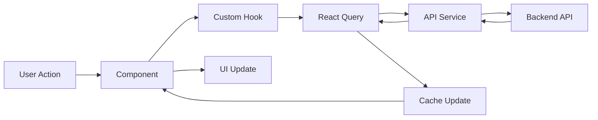

# Wiki do PoupeAI Mobile

Bem-vindo à documentação completa do **PoupeAI Mobile**, um aplicativo React Native + Expo para controle financeiro pessoal.

## 📱 Sobre o Projeto

PoupeAI Mobile é um aplicativo de gestão financeira pessoal que oferece uma experiência móvel intuitiva e moderna. Desenvolvido com React Native e Expo, integra com sistema de autenticação OAuth/Keycloak e fornece ferramentas completas para controle de gastos, orçamentos, metas e análises financeiras.

### 🎯 Principais Funcionalidades

- **Dashboard Financeiro**: Visão consolidada de saldos, receitas e despesas
- **Gestão de Transações**: Cadastro e categorização de movimentações financeiras
- **Orçamentos Inteligentes**: Criação e acompanhamento de orçamentos por categoria
- **Metas Financeiras**: Definição e progresso de objetivos de economia
- **Cartões de Crédito**: Controle de limites e faturas
- **Categorização Flexível**: Sistema de cores personalizado para organização
- **Relatórios Visuais**: Gráficos e análises de padrões de gastos
- **Sincronização Multi-dispositivo**: Dados sempre atualizados na nuvem

## 📚 Documentação

### Para Desenvolvedores

| Documento | Descrição |
|-----------|-----------|
| [🏗️ Arquitetura](./architecture.md) | Estrutura técnica, padrões arquiteturais e fluxo de dados |
| [🧩 Componentes](./components.md) | Guia completo dos componentes UI (Atomic Design) |
| [🌐 API e Integração](./api-integration.md) | Endpoints, autenticação OAuth2 e hooks de integração |
| [👨‍💻 Guia de Desenvolvimento](./development-guide.md) | Setup, convenções, debugging e deployment |

### Recursos Técnicos

- **Framework**: React Native 0.76.9 + Expo 52.0
- **Linguagem**: TypeScript 5.3 com tipagem estrita
- **Navegação**: Expo Router 4.0 (file-based routing)
- **Estado**: React Query 5.83 + Context API
- **Autenticação**: OAuth2 + PKCE via Keycloak
- **UI**: Atomic Design + Sistema de temas (light/dark/auto)
- **Performance**: Cache inteligente, lazy loading, optimistic updates

## 🚀 Quick Start

### 1. Pré-requisitos
```bash
# Instalar Node.js 18+, Expo CLI e dependências de desenvolvimento
npm install -g @expo/cli
```

### 2. Configuração
```bash
# Clone e instale dependências
git clone https://github.com/POUPE-AI/poupeai-mobile.git
cd poupeai-mobile
npm install

# Configure variáveis de ambiente
cp .env.example .env
# Edite .env com suas configurações do Keycloak e API
```

### 3. Desenvolvimento
```bash
# Inicia o servidor de desenvolvimento
npm start

# Para plataformas específicas
npm run android  # Android
npm run ios      # iOS
npm run web      # Web
```

## 🏗️ Arquitetura em Resumo

### Organização de Componentes (Atomic Design)

```
🔬 Atoms: Elementos básicos reutilizáveis
├── Button, Text, FormField, ActionButton
└── Focados em uma única responsabilidade

🧬 Molecules: Combinações funcionais
├── TransactionsList, BudgetModal, CategoryModal
└── Encapsulam lógica específica mas reutilizável

🖥️ Screens: Telas completas
├── Dashboard, Transactions, Budgets, Profile
└── Específicas para cada rota da aplicação
```

### Fluxo de Dados



### Estrutura de Pastas

```
poupeai-mobile/
├── 📱 app/                    # Roteamento (expo-router)
│   ├── _layout.tsx           # Providers raiz (Auth, Theme, Query)
│   ├── login.tsx             # Tela de login OAuth
│   └── (drawer)/             # Área autenticada
│       └── (tabs)/           # Navegação principal
├── 🧩 src/
│   ├── components/           # UI Components (Atomic Design)
│   ├── contexts/             # React Contexts (Auth, Theme)
│   ├── hooks/                # Custom Hooks de integração
│   ├── services/             # Camada de API
│   ├── types/                # Definições TypeScript
│   └── utils/                # Utilitários e helpers
└── 📚 docs/                  # Esta documentação
```

## 🔐 Autenticação e Segurança

### OAuth2 + PKCE Flow
- **Keycloak**: Servidor de autenticação centralizado
- **PKCE**: Proof Key for Code Exchange para máxima segurança mobile
- **Token Management**: Refresh automático e armazenamento seguro
- **Deep Linking**: URLs seguras para callback OAuth

### Integração com API
- **Base URL**: Configurável por ambiente (dev/staging/prod)
- **Interceptors**: Token injection automático e retry logic
- **Error Handling**: Tratamento global com feedback ao usuário
- **Offline Support**: Cache persistente para funcionalidade offline

## 🎨 Sistema de Design

### Temas
- **Light Mode**: Tema claro padrão
- **Dark Mode**: Tema escuro para economia de bateria
- **Auto Mode**: Seguir preferência do sistema operacional

### Cores e Tipografia
- **Paleta Primária**: Tons de laranja (#FF660F)
- **Feedback Colors**: Verde, amarelo, vermelho para status
- **Typography Scale**: 4 variantes (title, subtitle, body, caption)
- **Responsive Design**: Adaptação automática a diferentes telas

## 📊 Performance e Otimização

### React Query
- **Cache Inteligente**: Hierarquia de chaves para invalidação precisa
- **Background Sync**: Atualizações automáticas em background
- **Optimistic Updates**: UI responsiva com rollback em caso de erro
- **Offline First**: Funcionalidade mesmo sem conexão

### Bundle Optimization
- **Code Splitting**: Carregamento lazy de telas
- **Tree Shaking**: Remoção de código não utilizado
- **Asset Optimization**: Compressão de imagens e recursos
- **Metro Bundler**: Otimizações específicas para React Native

## 🧪 Qualidade e Testes

### Testing Strategy
- **Unit Tests**: Jest + React Native Testing Library
- **Integration Tests**: Testes de hooks com React Query
- **E2E Tests**: Planejado com Detox
- **Type Safety**: TypeScript com strict mode habilitado

### Code Quality
- **ESLint**: Regras customizadas para React Native
- **Prettier**: Formatação automática consistente
- **Husky**: Git hooks para validação pré-commit
- **Conventional Commits**: Padrão para mensagens de commit

## 🚀 Build e Deploy

### Expo Application Services (EAS)
- **Development Builds**: Para desenvolvimento e testes internos
- **Preview Builds**: Para QA e validação de stakeholders
- **Production Builds**: Para submission nas stores

### CI/CD Pipeline
- **GitHub Actions**: Automação de build e testes
- **Automated Testing**: Execução de testes em cada PR
- **Store Deployment**: Deploy automático para App Store e Play Store

## 🤝 Como Contribuir

### Para Desenvolvedores
1. **Fork** o repositório
2. **Clone** sua fork localmente
3. **Crie uma branch** para sua feature (`git checkout -b feature/nova-funcionalidade`)
4. **Commit** suas mudanças seguindo Conventional Commits
5. **Push** para sua branch (`git push origin feature/nova-funcionalidade`)
6. **Abra um Pull Request** com descrição detalhada

### Reportar Issues
- Use os templates de issue no GitHub
- Inclua passos para reproduzir bugs
- Adicione screenshots quando relevante
- Especifique ambiente (iOS/Android/versão)

## 📞 Suporte

### Documentação
- **README Principal**: Visão geral e quick start
- **Architectural Guide**: Detalhes técnicos aprofundados
- **Component Library**: Catálogo completo de componentes
- **API Reference**: Endpoints e integração

### Contato
- **GitHub Issues**: Para bugs e feature requests
- **GitHub Discussions**: Para dúvidas e discussões
- **Email**: developer@poupeai.com

## 📈 Roadmap

### Versão Atual (1.0.0)
- ✅ Autenticação OAuth2 + PKCE
- ✅ Dashboard com gráficos
- ✅ Gestão de transações
- ✅ Sistema de orçamentos
- ✅ Categorização flexível
- ✅ Temas light/dark/auto

### Próximas Versões
- 🔄 Sincronização em tempo real
- 📱 Notificações push
- 💳 Integração bancária (Open Banking)
- 🤖 IA para categorização automática
- 📊 Relatórios avançados
- 🌍 Internacionalização (i18n)

## ⚖️ Licença

Este projeto está licenciado sob a [MIT License](../LICENSE).

---

**PoupeAI Mobile** - Desenvolvido com ❤️ pela equipe POUPE.AI

*Documentação atualizada em: Julho 2025*
*Versão do app: 1.0.0*
